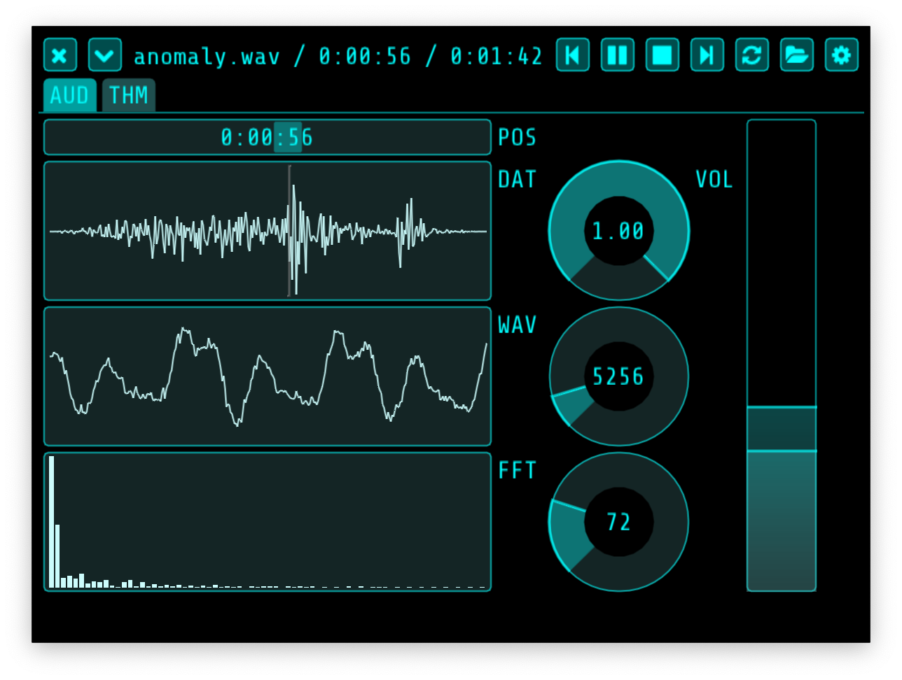

# Nightingale - audio player

## Building

	% make
	% ./nightingale

See `.github/workflows/build.yaml` for more details.

## Note

I'm using this project as a playground to learn Dear ImGui and to play with audio
technology. Nightingale is meant to be a fun toy. I hope you like it.

## Thanks

Made with the excellent
[Dear ImGui](https://github.com/ocornut/imgui),
[miniaudio](https://miniaud.io),
[pffft](https://bitbucket.org/jpommier/pffft),
and [nativefiledialog](https://github.com/mlabbe/nativefiledialog).

