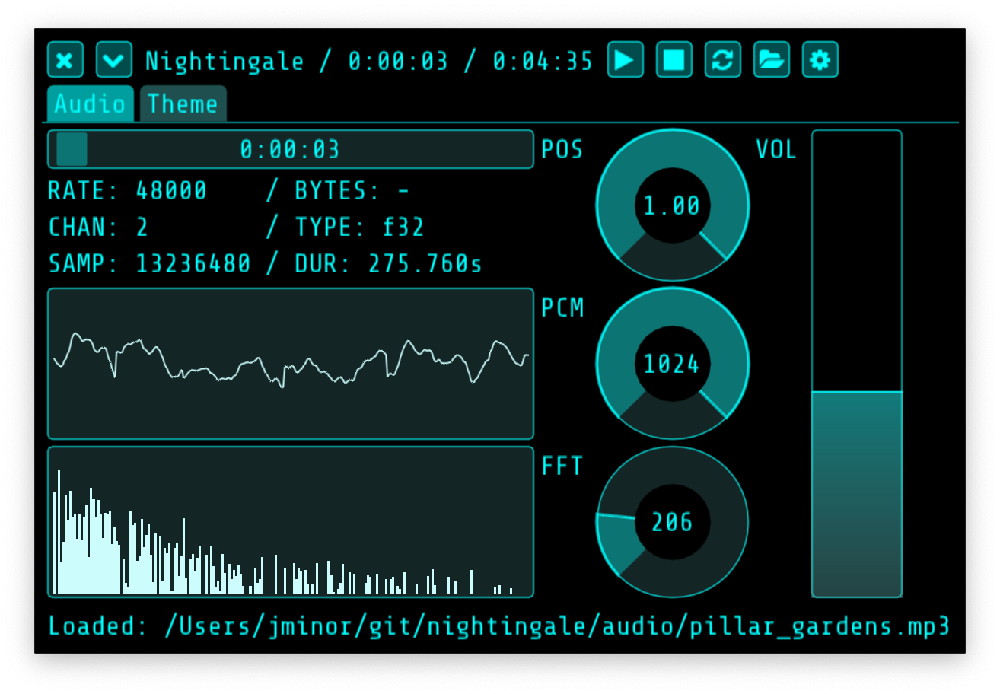

# Nightingale - media player

## Building

If you prefer `make`
	% make
	% ./nightingale

If you prefer `cmake`
  % mkdir build
  % cd build
  % cmake ..
  % cmake --build .
  % ./nightingale

See `.github/workflows/build.yaml` for more details.

## Thanks

Made with the excellent [Dear ImGui](https://github.com/ocornut/imgui), [SoLoud](http://sol.gfxile.net/soloud/), and [dr_mp3](https://github.com/mackron/dr_libs/blob/master/dr_mp3.h).

